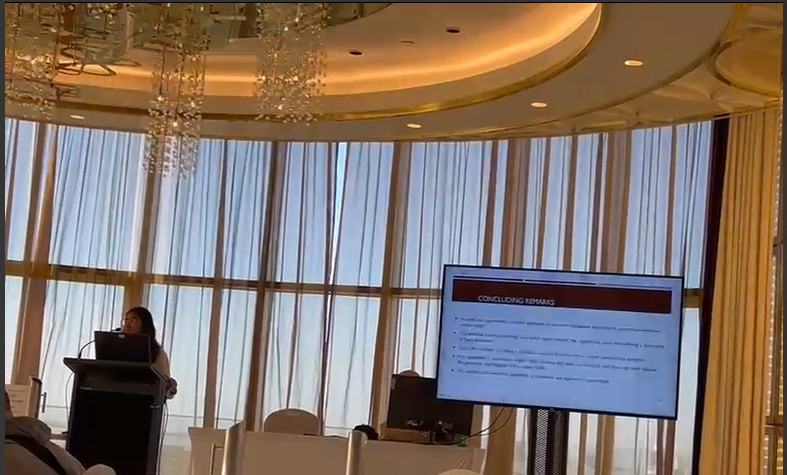

  

    
In this work, we introduce a novel and computationally feasible approach to construct Lyapunov functions for equilibria of nonlinear continuous vector fields. In a general sense, the procedure involves selecting a compact region around the equilibrium point of a given vector field and defining a dictionary of functions in which a Lyapunov function is anticipated to lie. Subsequently, an algorithmic methodology is employed on this selected (neighborhood, dictionary) pair. The algorithm's primary objective is to identify a function that meets a compact set of inequalities encapsulating the Lyapunov function's behavior within the selected region. Notably, this technique is applicable to continuous nonlinear vector fields without requiring special algebraic structures, and it does not even require analytical expressions of the vector fields. A collection of numerical instances is provided to demonstrate the efficacy of our approach.

  

<figure style="margin-left: 20px; max-width: 100%;">
    
    <figcaption>Photograph captured during my presentation of the paper in Gold Coast, Australia.</figcaption>
</figure>

