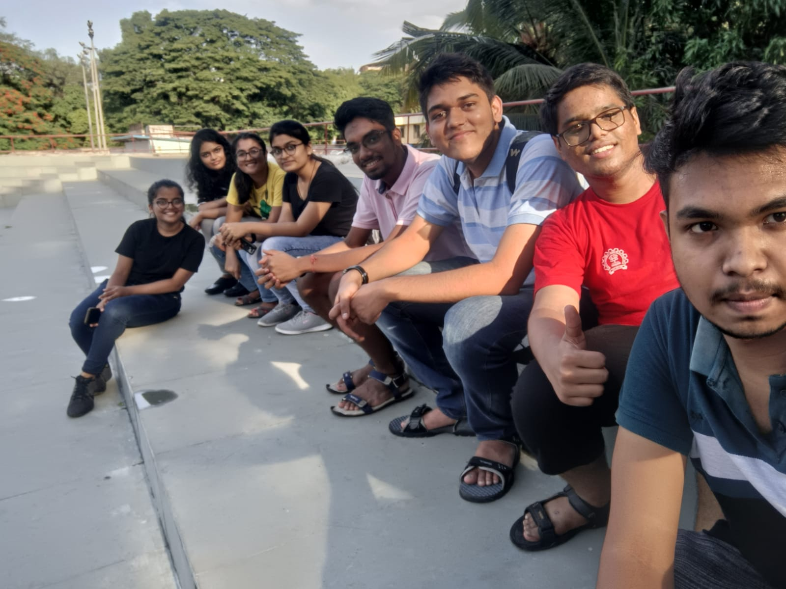

  
 

    

      I have had the pleasure to be a Teaching Assistant (TA) for 120+ freshmen and sophomores at IIT Bombay on four distinct occasions. My experience about one of them can be found in this <a href="https://ee-damp.github.io/2022-12-21-TAship_blogs_MA111/" target="_blank">blog</a> curated for the Electrical Engineering Department Academic Program, IITB. Courses I have assisted:
    

    <ol>
        <li>MA108: Differential Equations - I</li>
        <li>MA207: Differential Equations - II</li>
        <li>MA111: Calculus (twice)</li>
    </ol>
  

